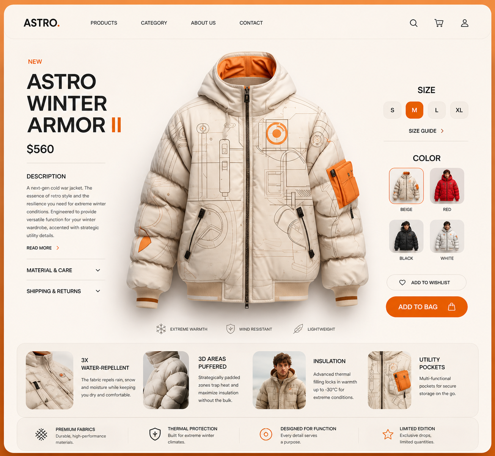
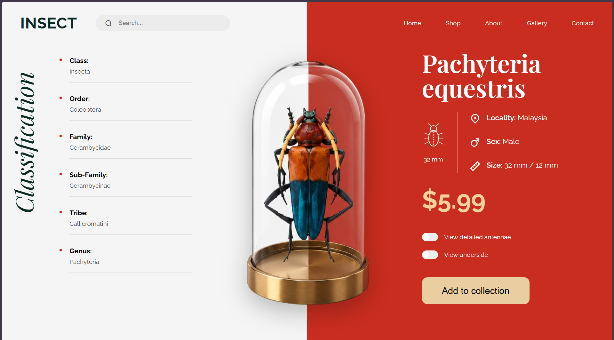
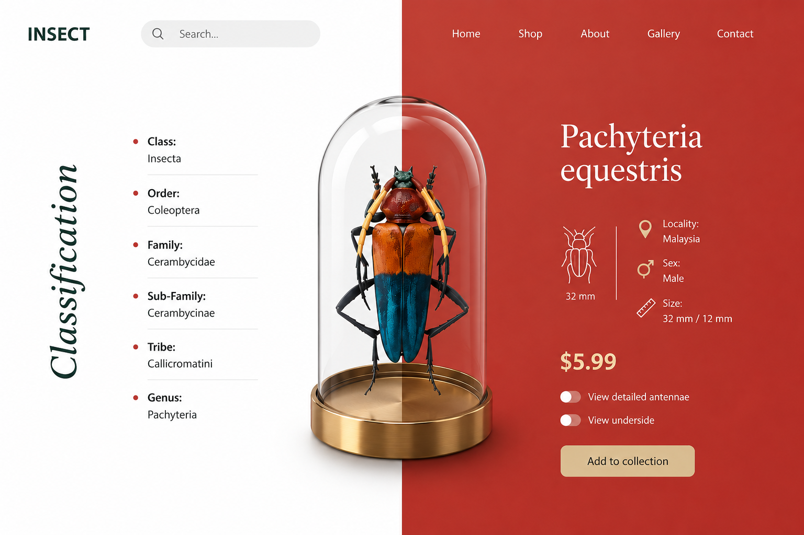
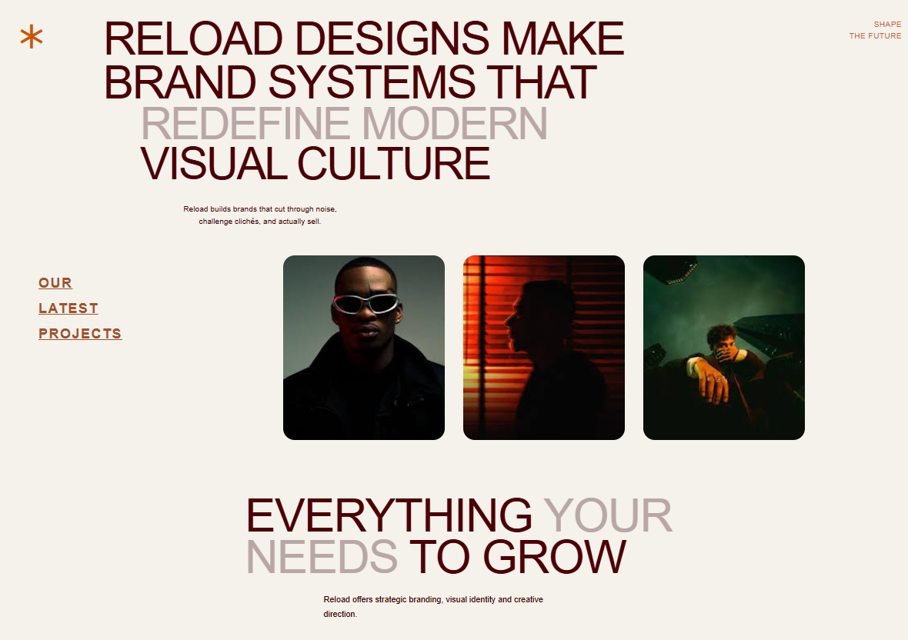
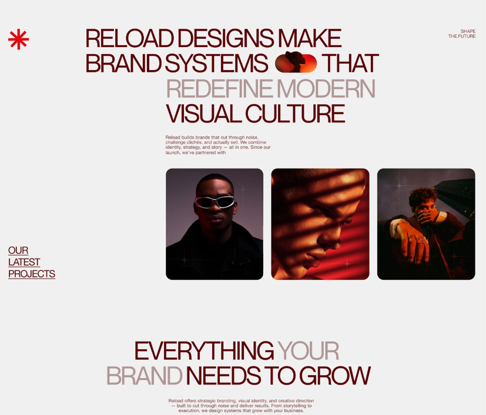

# UI Projects Collection

A collection of modern UI recreations built using pure HTML and CSS.

These projects focus on:
- Responsive layouts
- Flexbox positioning
- UI structuring
- Real-world frontend practices
- Modern visual design
- CSS positioning concepts

---

# Projects Included

## 1. ASTRO Winter Armor UI

A premium winter jacket e-commerce landing page inspired by modern fashion product interfaces.

### Features
- Responsive navbar
- Product showcase section
- Interactive size selector UI
- Product color cards
- Feature cards section
- Wishlist and add-to-bag buttons
- Modern Flexbox layout

### Tech Used
- HTML5
- CSS3
- Remix Icons

### Preview

#### My Work


#### Original Reference


---

## 2. Insect Showcase UI

A futuristic insect classification showcase interface inspired by premium experimental UI designs.

### Features
- Split-screen layout
- Center-positioned insect showcase
- Taxonomy information panel
- Modern search bar
- SVG insect icon
- Custom toggle switches
- Advanced positioning techniques

### Tech Used
- HTML5
- CSS3
- Remix Icons
- Google Fonts

### Preview

#### MY WORK


### ORIGINAL REFERENCE

---
## 3. Reload Brand UI

A modern editorial-style branding and creative agency landing page built using pure HTML and CSS.

### Features
- Large editorial typography
- Asymmetrical modern layout
- Responsive image gallery
- Minimal branding aesthetic
- Flexbox-based structure
- Relative & absolute positioning
- Responsive spacing techniques

### Tech Used
- HTML5
- CSS3
- Remix Icons

### Preview

#### My Work


### REFERENCE


## Folder Structure

```plaintext
ui-projects/
│
├── astro-winter-ui/
│
├── insect-showcase-ui/
│
├── Brand-page-ui/
│
└── README.md
```