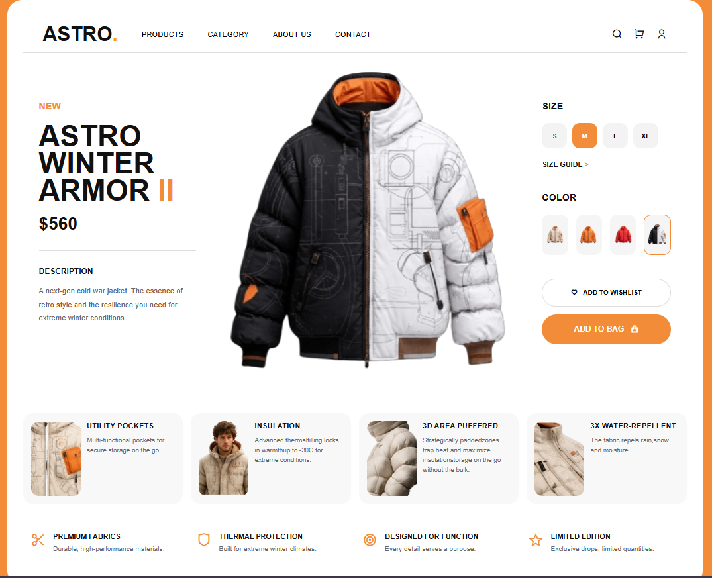

# ASTRO Winter Armor UI

A modern winter jacket product landing page built using pure HTML and CSS.

## Preview

This project recreates a premium fashion/e-commerce product UI with a strong focus on:

* Responsive Flexbox layouts
* Clean UI structuring
* Modern product showcase design
* Proper spacing and alignment
* CSS positioning concepts
* Reusable UI sections

---

## Features

* Modern responsive navbar
* Product showcase section
* Interactive size selector UI
* Product color preview cards
* Wishlist and add-to-bag buttons
* Feature information cards
* Premium product information section
* Responsive Flexbox-based layout
* Clean and structured HTML/CSS architecture

---

## Tech Stack

* HTML5
* CSS3
* Remix Icons

---

## Folder Structure

```plaintext
project/
│
├── index.html
├── style.css
│
├── images/
│   ├── black&white-jacket.png
│   ├── orange-jacket.png
│   ├── beige-jacket.png
│   ├── red-jacket.png
│   └── feature images...
```

---

## Concepts Practiced

* Flexbox layouts
* Relative sizing
* Responsive spacing
* CSS positioning
* Reusable card components
* UI alignment techniques
* Product page structuring
* Modern e-commerce design patterns

---

## Screenshots

### My Work


### Original Reference


---

## Author

Nevanth Sai Vignesh

